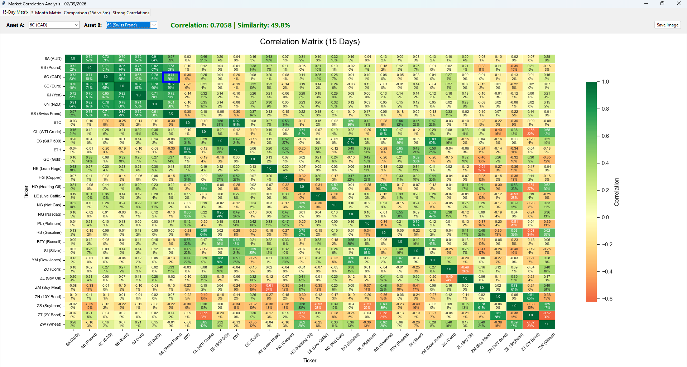

# Market Correlation Analysis



A professional Python-based tool to analyze correlations between various financial markets (Currencies, Fixed Income, Commodities, Cryptocurrencies, and Indices) using real-time data from Yahoo Finance.

## Features

- **Multi-Market:** Monitors over 30 key financial assets.
- **Dual Time Horizon:** Compare short-term (15 days) vs. medium-term (3 months) correlations.
- **Difference Analysis:** Visualize how relationships between assets are evolving (converging or diverging).
- **Strong Correlation Filter:** Automatically identifies "Twin" or "Mirror" assets for hedging or diversification strategies.
- **Cross-Platform GUI:** Tkinter interface that works on Windows, macOS, and Linux.
- **Export:** Save heatmaps as high-resolution images (.png).

## Project Structure

```
market-correlation-analysis/
├── correlation_analysis/       # Main package
│   ├── __init__.py
│   ├── config.py               # Constants, thresholds, asset definitions
│   ├── data.py                 # Data downloading & correlation computation
│   └── gui.py                  # Tkinter GUI application
├── tests/                      # Unit tests
│   ├── test_config.py
│   ├── test_data.py
│   └── test_gui.py
├── main.py                     # Entry point
├── requirements.txt            # Pinned dependencies
├── pyproject.toml              # Project metadata & build config
├── LICENSE
└── README.md
```

## Installation

### Requirements

- Python >= 3.10
- Dependencies: `yfinance`, `pandas`, `seaborn`, `matplotlib`, `numpy`

### Setup

```bash
# Clone the repository
git clone https://github.com/your-user/market-correlation-analysis.git
cd market-correlation-analysis

# Install dependencies
pip install -r requirements.txt

# Run the application
python main.py
```

### Development

```bash
# Install with dev dependencies
pip install -e ".[dev]"

# Run tests
pytest

# Run tests with coverage
pytest --cov=correlation_analysis
```

## Strategy Guide

| Correlation | Interpretation | Strategy |
|---|---|---|
| > 0.80 | **Twins** - Assets move almost identically | Risk of doubling exposure |
| 0.50 to 0.80 | **Moderate Positive** | Partial overlap in movement |
| -0.20 to 0.20 | **Independent** | Ideal for diversification |
| -0.50 to -0.80 | **Moderate Inverse** | Partial hedge |
| < -0.80 | **Mirror** - Assets move in opposite directions | Ideal for hedging |

## Configuration

Asset definitions and all thresholds are centralized in `correlation_analysis/config.py`. You can customize:

- **ASSETS**: Dictionary of asset names to Yahoo Finance tickers
- **SECTORS**: Sector groupings for the Strong Correlations tab
- **SHORT_TERM_DAYS / MEDIUM_TERM_DAYS**: Correlation time windows (default: 15 / 60)
- **Thresholds**: All classification thresholds (twins, mirror, etc.)

## Key Improvements (v2.0)

- Modular architecture: split monolithic script into `config`, `data`, and `gui` modules
- Fixed deprecated `applymap()` call (pandas 2.2+ compatibility)
- Fixed crash on heatmap clicks when coordinates are `None`
- Replaced bare `except: pass` with specific `tk.TclError` handling
- Extracted all magic numbers into named constants
- Added type hints throughout
- Added logging instead of `print()` statements
- Added proper state management (`_HeatmapTabState` class instead of dynamic frame attributes)
- Cross-platform theme selection (falls back to `clam`/`alt` on non-Windows)
- Added `requirements.txt` and `pyproject.toml` for reproducible installs
- Added comprehensive unit test suite
- Added docstrings to all public functions and classes

---
Developed for technical and quantitative analysis of global markets.
